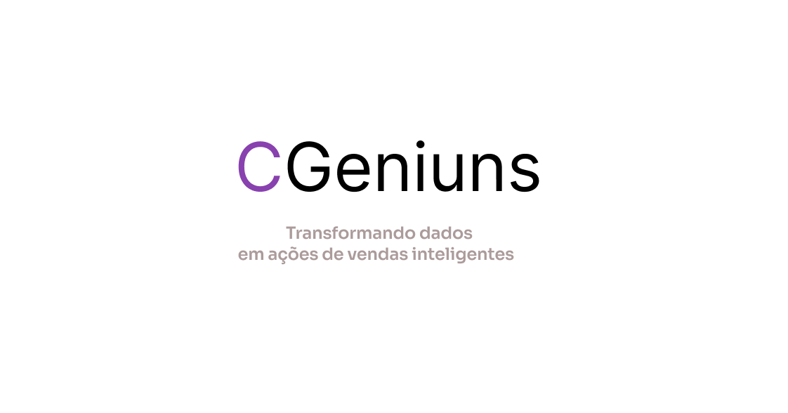

-----------------------------------------------------------------------------------------------
# Elite Sales Conversion System

O **Sistema de Melhoria de Conversão de Vendas** é uma solução inovadora que utiliza tecnologias avançadas de análise de dados e inteligência artificial para otimizar o desempenho das equipes de vendas, recomendando scripts personalizados para cada cliente. Este projeto é desenvolvido usando Expo, uma ferramenta que simplifica o desenvolvimento de aplicativos multiplataforma.

## Funcionalidades Principais

- **Geração de Scripts Personalizados**: Utiliza algoritmos de inteligência artificial para analisar dados de vendas e comportamento do cliente, gerando scripts de vendas personalizados para cada cliente.
  
- **Aplicativo para Atendentes**: Permite que os atendentes acessem informações dos clientes em tempo real e visualizem os scripts personalizados recomendados para cada um.

## Tecnologias Utilizadas

- **Expo**: Plataforma de desenvolvimento de aplicativos móveis multiplataforma baseada em React Native.
  
- **React Native**: Biblioteca TypeScript para construção de interfaces de usuário.

- **Inteligência Artificial e Análise de Dados**: Algoritmos de aprendizado de máquina para análise de dados de vendas e geração de scripts personalizados.

---------------------------------------------------------------------------------------------------
## Links IMPORTANTES 

- [Documentação](https://www.canva.com/design/DAGAir27KBs/oFuM4YXEwXR9ak2QrdjAxg/edit?utm_content=DAGAir27KBs&utm_campaign=designshare&utm_medium=link2&utm_source=sharebutton)
  
- [Figma](https://www.figma.com/design/8MgbSfwg9FcJ6KLKv6pUg5/CGeniuns?node-id=95%3A64&t=NM9tCq7GftOpHwEV-1)
  
- [Back-end](https://github.com/MarcosHGdaSilva/cgeniuns.git)

-----------------------------------------------------------------------------------------------------
# Como Executar o Projeto

1. **Clone o Repositório**:

```bash
git clone https://github.com/leonardo-bragatti/challenge-plusoft-2tdsa-2024-cgeniuns.git
```
2.Instale as Dependências:
```
cd challenge-plusoft-2tdsa-2024-cgeniuns
npm install
```
3.Execute o Projeto:
```
npx expo start
```
4.Acesse o Aplicativo:

Escaneie o QR code gerado com o aplicativo Expo Go em seu dispositivo móvel, ou
Abra o simulador iOS ou Android, dependendo da sua preferência, ou
Acesse via web.

5.Para Alterar a Porta do Back-end:

Caso vá executar o back-end em uma porta diferente, modifique o arquivo service/apiService.ts no front-end:
web:'http://localhost:8080'
mobile: porta do seu pc


6.Para Fazer Login:

Utilize as seguintes credenciais:

-Usuário: 32165498710 / Senha: 654321
-Usuário: 32165498711 / Senha: 654321

7.Contribuição

Contribuições são bem-vindas! Sinta-se à vontade para enviar pull requests com melhorias, correções de bugs ou novas funcionalidades.

---------------------------------------------
Licença

Obrigada pela atenção!

Anna.
Cgeniuns.
